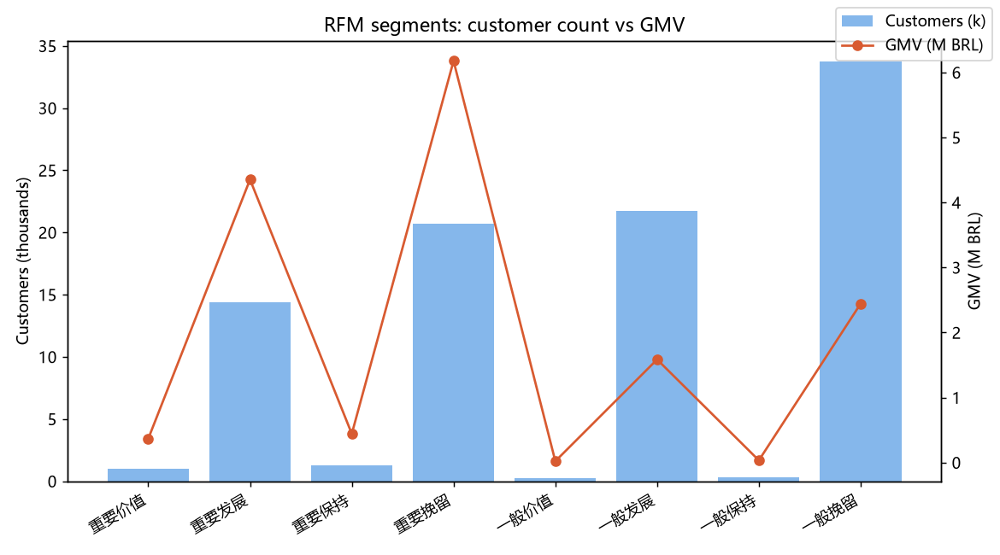
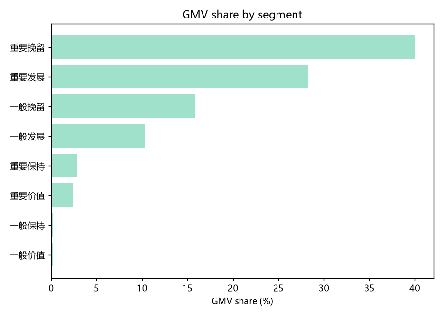

# 电商客户价值分层分析报告（RFM 模型）

> **项目**：用户分层与精细化运营建议
> **数据**：Brazilian E-Commerce Public Dataset by Olist（Kaggle 公开数据集，真实匿名商业数据，CC BY-NC-SA 4.0）
> **日期**：2026-09-07

---

## 摘要

巴西 Olist 电商平台 2016–2018 年共 9.9 万订单，清洗后得到 96,477 笔已交付且有支付记录的交易、93,357 名客户，交易额合计 1,542 万 BRL。本报告用 RFM 模型把这批客户分成 8 类并做画像。

**三个主要发现：**

1. **交易额高度依赖大额单次购买客户。** 37.6% 的客户贡献了 68.3% 的交易额，其中 2.07 万名沉睡大额客户（重要挽留层）独占 40.1%，1.44 万名近期大额客户（重要发展层）占 28.2%。
2. **复购客户只有 3%。** 但这批人在观察窗口内的人均累计消费约为单次客户的 1.9 倍，应作为重点维护对象。
3. **客户高度集中在圣保罗州。** 各客群的 SP 州占比都在 34%–62%。不过这只说明客户数量集中，是否可以不按州做差异化运营，还要看复购率、消费金额和履约表现。

综合来看，平台当下的重点不在拉新，而是把这批大额单次客户分层运营：2.07 万沉睡大额客户做系统性召回，1.44 万近期大额客户做首购后复购培育，同时保护好仅有的 2,238 名复购高价值客户。

---

## 1. 业务背景与目标

Olist 是连接巴西中小商家与多个销售渠道的电商平台，模式类似国内的平台型电商。本次分析主要回答三个问题：客户结构如何、哪些客户贡献主要交易额，以及运营资源应如何分配。

分析使用 RFM（最近购买 Recency、购买频率 Frequency、消费金额 Monetary）进行客户价值分层，并据此提出分客群运营建议。

## 2. 数据说明

| 项 | 内容 |
|---|---|
| 数据源 | Brazilian E-Commerce Public Dataset（Kaggle，Olist 官方发布） |
| 规模 | 9.9 万订单 / 9.6 万客户 / 2016–2018 两年 / 8 张关联表 |
| 许可 | CC BY-NC-SA 4.0（须署名、非商用） |
| 清洗结果 | 96,477 笔已交付且有支付的交易 / 93,357 名有效客户 / 15,422,461.77 BRL |

口径约定四条：

1. **成交**：`order_status = 'delivered'` 且支付表中有记录的订单，共 96,477 单；
2. **金额**：支付表 `payment_value` 求和。这是消费者支付金额口径，可能含运费，不是 Olist 平台的净收入，所以全文用"交易额"而不是"收入"；
3. **客户主体**：去重客户标识 `customer_unique_id`（同一个人换地址下单会生成多个 customer_id，需要合并）；
4. **时间锚点**：2018-09-01。

## 3. 方法与规则

- **R**：2018-09-01 减去该客户最近一笔交易日期，单位天，越小越近
- **F**：已交付且有支付记录的订单数。97% 的客户只有 1 单，所以 F 的高低以"是否复购（≥2 单）"为界，而不是固定的中位数切分
- **M**：已交付且有支付记录订单的支付金额合计，单位 BRL
- **打分**：R 和 M 各按动态五分位打 1–5 分，≥4 分为"高"；F ≥2 视为"高"
- **8 类映射**：R/F/M 高低的八种组合对应八个客群名，M 高的四类归入"重要"档

| R | F | M | 客群 |
|---|---|---|---|
| 高 | 复购 | 高 | 重要价值（核心忠实） |
| 高 | 单次 | 高 | 重要发展（高潜新客） |
| 低 | 复购 | 高 | 重要保持（复购沉睡） |
| 低 | 单次 | 高 | 重要挽留（大额沉睡） |
| 高 | 复购 | 低 | 一般价值 |
| 高 | 单次 | 低 | 一般发展 |
| 低 | 复购 | 低 | 一般保持 |
| 低 | 单次 | 低 | 一般挽留（沉睡小额） |

## 4. 分析结果

### 4.1 客户分层总览

| 客群 | 客户数 | 占比 | 交易额(BRL) | 交易额占比 | 人均累计消费(BRL) | 复购率 |
|---|---:|---:|---:|---:|---:|---:|
| 重要价值 | 983 | 1.05% | 366,575 | 2.38% | 372.9 | 100% |
| 重要发展 | 14,406 | 15.43% | 4,352,767 | 28.22% | 302.2 | 0% |
| 重要保持 | 1,255 | 1.34% | 442,562 | 2.87% | 352.6 | 100% |
| **重要挽留** | **20,699** | **22.17%** | **6,176,779** | **40.05%** | 298.4 | 0% |
| 一般价值 | 218 | 0.23% | 21,126 | 0.14% | 96.9 | 100% |
| 一般发展 | 21,736 | 23.28% | 1,585,082 | 10.28% | 72.9 | 0% |
| 一般保持 | 345 | 0.37% | 34,094 | 0.22% | 98.8 | 100% |
| 一般挽留 | 33,715 | 36.11% | 2,443,477 | 15.84% | 72.5 | 0% |
| **合计** | **93,357** | 100% | **15,422,462** | 100% | 165.2 | 3% |

> **人均累计消费** = 该客群交易额 ÷ 客户数；**客单价** = 交易额 ÷ 订单数。单次购买客群一客一单，两个数相等；复购客群的人均累计消费明显高于客单价（比如重要价值，人均累计 372.9 而客单价只有 170.9）。

### 4.2 客群画像

| 客群 | 主州 | 主州占比 | 主支付方式 | 特征 |
|---|---|---:|---:|---|
| 重要价值 / 重要保持 | SP | 39–44% | 信用卡 77% | 复购客，真实客单价 168–171 BRL，靠复购把人均累计消费拉到 353–373 BRL；人少但价值密度高 |
| 重要发展 / 重要挽留 | SP | 34–39% | 信用卡 79–81% | 大额单次客，人均累计消费约 300 BRL（一客一单，即客单价）；两类合起来是交易额的主体 |
| 一般发展 / 一般挽留 | SP | 43–50% | 信用卡 73–75% | 小额客户，人均累计消费 72–99 BRL，量大但价值低 |

所有客群的第一大州都是圣保罗。但数量集中不等于行为同质——要不要做区域差异化运营，还得看各州的复购率、消费金额和履约时长，见建议 4。

## 5. 结论与运营建议

**建议 1（最高优先）：2.07 万沉睡大额客户做召回，1.44 万近期大额客户做复购培育**

这两类都是大额单次购买客户，合计 35,105 人、占 37.6%，贡献 68.3% 交易额，但购买时点不同，动作必须分开：

- **重要挽留（2.07 万人，40.1% 交易额）= 沉睡大额**：久未购买，做唤醒召回——90 天未回购窗口推送，配合专属优惠和个性化邮件。按其客单价 298.41 BRL、5% 唤醒率估算，可回收约 **30.9 万 BRL**（20,699 × 5% × 298.41 ≈ 308,839）。这是交易额情景估算，不是 ROI，优惠券、触达和履约成本都没扣。
- **重要发展（1.44 万人，28.2% 交易额）= 近期大额首购，不是沉睡**：刚买过大额但尚未复购，做首购后 30/60 天复购培育（物流确认、品类推荐、限时复购券），目标是把这批高潜首购转成复购。不能套用沉睡召回的唤醒率来估。

**建议 2：优先维护 2,238 名复购高价值客户**

重要价值 + 重要保持合计占交易额 5.25%，客单价 168–171 BRL，观察窗口内人均累计消费 353–373 BRL。复购（平均约 2.1 单）把人均累计消费抬到全部单次客户（160.8 BRL）的约 2.2 倍。在缺触达成本和实验结果的情况下，先把这批人当作高价值留存候选——专属客服、提前体验、介绍返券。

**建议 3：对 33,715 名小额沉睡客户采用低成本自动化触达**

这批人人均只有 72 BRL。用月度批量邮件加小额券自动触达（唤醒率按 2% 计，单轮交易额情景约 4.9 万 BRL：33,715 × 2% × 72.47 ≈ 48,871，未扣成本），把营销人力集中到建议 1 和 2。

**建议 4：SP 数量集中，但要不要分州运营得先验证**

SP 州的客户数量占比明显更高，但现有证据只覆盖客户数量这一个维度。跨州的行为是否同质（复购率、消费金额、履约时长）还没检验，建议做一次"履约时长 vs 复购"的关联分析（订单表里有实际送达时间），再决定是否需要区域差异化运营。

## 6. 局限与后续

- 金额单位为巴西雷亚尔，未做汇率换算；
- R 维度对 2016 年的极早期客户偏长（观察窗口有两年），对近期客户区分度好；
- RFM 反映的是观察窗口（2016-10 至 2018-08）内的购买行为，属于截面画像，不能直接等同于客户生命周期价值；运营建议里的召回金额都是交易额情景估算，不是 ROI（缺触达成本和实验数据）；
- 未覆盖的方向：评价与履约时延对复购的影响、商品品类偏好、按卖家维度的分层，都可作为二期；
- 数据许可为非商用（CC BY-NC-SA 4.0），作品集和学习展示可用，商用需替换数据源。

---

*本报告的全部数字由 `scripts/rfm_pipeline.py` 计算产出，脚本内含客户数、订单数、金额三项断言。*
