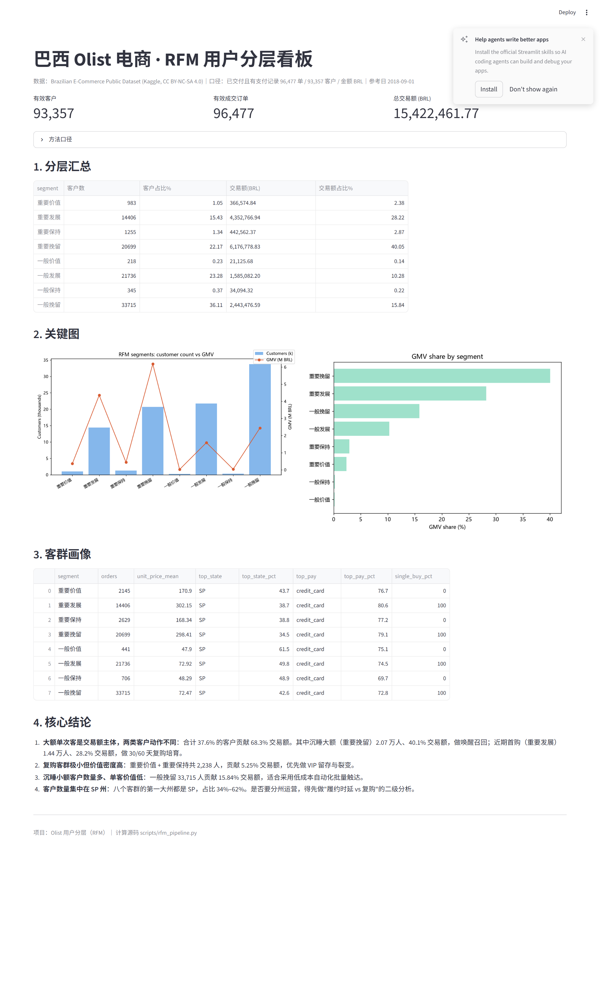

# Olist 电商客户价值分层分析（RFM）

本项目使用巴西 Olist 公开电商数据（9.9 万订单、2016–2018 年、8 张业务表）进行客户价值分层，包含数据体检、SQL 与 Python 两套 RFM 实现、8 类客群画像、运营建议和交互看板。两种实现的分层结果逐项一致。

数据来自 Kaggle 的 *Brazilian E-Commerce Public Dataset by Olist*，真实匿名商业数据，许可 CC BY-NC-SA 4.0（须署名、非商用）。完整分析见 [`04_用户分层项目报告.md`](04_用户分层项目报告.md)。

## 核心结论

| 发现 | 数字 |
|---|---|
| 交易额主要来自大额单次购买客户 | 37.6% 的客户（35,105 人）贡献 68.3% 交易额 |
| 沉睡大额客户贡献的交易额最高 | 重要挽留层 2.07 万人贡献 40.1% 交易额 |
| 复购几乎不存在 | 仅 3%（2,801 人）复购；但这批人在观察窗口内的人均累计消费约为单次客户的 1.9 倍 |
| 客户高度集中在圣保罗 | SP 州占各客群 34%–62% |

由此对应的运营动作：

- **重要挽留（2.07 万人，40.1% 交易额）** 是沉睡的大额客户，做唤醒召回。按客单价 298.41 BRL、5% 唤醒率估算，交易额情景约 30.9 万 BRL——这是情景估算，不是 ROI，触达和券的成本都没扣。
- **重要发展（1.44 万人，28.2% 交易额）** 是刚买过大额但还没复购的新客，做首购后 30/60 天复购培育，不能套用沉睡召回的假设。
- **重要价值 + 重要保持（2,238 人）** 是复购高价值客户，应优先维护并验证留存策略。

SP 州数量集中只说明了客户数量这一个维度；跨州的复购率、消费金额、履约表现是否也一致还没验证，所以要不要分州运营，得等"履约时长 vs 复购"的二级分析出来再定。

## 快速复现

```bash
# 1) 环境（Python 3.9+）
python -m venv .venv
source .venv/bin/activate            # Windows: .venv\Scripts\activate
pip install -r requirements.txt

# 2) 下载数据（8 张 CSV -> data_olist/，跳过 61MB 的 geolocation 表）
python scripts/download_data.py
#    若镜像失效，到 https://www.kaggle.com/datasets/olistbr/brazilian-ecommerce 手动下载同名 CSV 放入 data_olist/

# 3) CSV -> SQLite（生成 olist.db）
python scripts/build_olist_db.py

# 4) 主计算：RFM 三维度 -> 打分 -> 8 类分层 -> 画像 -> 2 张图
python scripts/rfm_pipeline.py

# 5) SQL 版与 Python 版对账（输出无差异即通过）
python scripts/reconcile_sql_python.py

# 6) 导出 Power BI 建模数据集 -> output/powerbi/
python scripts/export_powerbi_dataset.py

# 7) 交互看板
streamlit run app/streamlit_app.py   # 浏览器打开 http://127.0.0.1:8501
```

`rfm_pipeline.py` 内置了客户数、订单数、金额三项断言，跑完会在控制台输出对账结果；不一致会直接报错。

产出：`output/rfm_base.csv`（93,357 名客户的 R/F/M）、`rfm_segments.csv`、`segment_summary.csv`、`segment_profile.csv`、`fig1_segment_size_revenue.png`、`fig2_revenue_share.png`。

## 目录结构

```
P1_RFM/
├── 01_数据体检报告_olist.md      # 数据体检与口径约定
├── 02_RFM分层结果与画像.md       # 分层结果、客群画像、SQL/Python 对账
├── 03_结论与建议.md              # 运营建议与局限说明
├── 04_用户分层项目报告.md        # ★ 终稿报告（作品集入口）
├── app/streamlit_app.py          # 交互看板
├── data_olist/                   # olist.db + 8 张原始 CSV
├── output/                       # 结果 CSV、图、看板截图
│   └── powerbi/                  # Power BI 建模数据集（见下）
├── scripts/
│   ├── download_data.py          # 下载数据
│   ├── build_olist_db.py         # CSV -> SQLite
│   ├── rfm_pipeline.py           # 主计算（pandas）
│   ├── reconcile_sql_python.py   # SQL/Python 自动对账
│   ├── export_powerbi_dataset.py # 导出 Power BI 数据集
│   └── shot_dashboard.py         # 看板整页截图（Playwright）
├── sql/                          # 可复跑 SQL（体检 / 窗口函数验证 / RFM 分层）
└── powerbi-dashboard/            # Power BI 看板工程源文件（PBIP 格式）
```

## 方法口径

| 项 | 规则 |
|---|---|
| 成交口径 | `order_status = 'delivered'` 且支付表有记录，得 96,477 单 |
| 客户主体 | 按 `customer_unique_id` 去重，得 93,357 人 |
| 金额 | 支付表 `payment_value` 先按订单汇总再求和，得 15,422,461.77 BRL。这是消费者支付金额口径（可能含运费），不是平台净收入 |
| R / M 打分 | 动态五分位打 1–5 分，≥4 分为"高" |
| F 高低 | 以是否复购（≥2 单）为界。97% 的客户只买过一单，用五分位中位切会失衡 |
| 8 类映射 | R / F / M 高低的八种组合，M 高的四类为"重要"档 |
| 时间锚点 | 2018-09-01。数据集尾部 2018 年 9–10 月只有 20 单，看着像导出截断 |

SQL 版和 pandas 版算出的 8 类人数逐项相同，运行 `python scripts/reconcile_sql_python.py` 可复核。两种实现之间出现过的差异及修正记录在 [`02_RFM分层结果与画像.md`](02_RFM分层结果与画像.md)。

## Power BI 数据集

`scripts/export_powerbi_dataset.py` 会导出三张表到 `output/powerbi/`：

| 文件 | 行数 | 用途 |
|---|---|---|
| `pbi_fact_customer.csv` | 93,357 | 客户级宽表：RFM 原始值与得分、客群、州、城市、首末单日期、主支付方式、平均评分 |
| `pbi_fact_order.csv` | 96,477 | 订单级事实表：订单日期、客群、州、支付金额与方式、评分，供时间趋势和地图下钻 |
| `pbi_dim_segment.csv` | 8 | 客群维表：中英文名、排序、定义、运营动作，供切片器和标签使用 |

三张表的口径与主计算一致，脚本内置断言校验。看板工程源文件（PBIP 格式，4 页报表 + 数据模型）见 `powerbi-dashboard/` 目录，用 Power BI Desktop 打开 `111.pbip` 即可查看。

## 已知局限

1. 金额单位是巴西雷亚尔，没有换算汇率；
2. R 维度对 2016 年的早期客户偏长（观察窗口有两年），对近期客户区分度较好；
3. 召回收益是交易额情景估算，不是 ROI——缺触达成本和实验数据；
4. 没做的部分：评价文本、商品品类、地理坐标、卖家维度、履约时延与复购的关系，都留作二期；
5. 97% 单次购买的结构让 F 维度只有"是否复购"这一个二分信号，做不出更细的频次分层。

## 看板截图



## 上传 GitHub 注意

`.gitignore` 已忽略 `data_olist/*.csv` 与 `data_olist/*.db`（合计约 65MB），换机器时用 `download_data.py` + `build_olist_db.py` 重建即可。

## License

- 仓库代码（scripts / sql / app）：[MIT](LICENSE)
- 数据集：Kaggle *Brazilian E-Commerce Public Dataset by Olist*，[CC BY-NC-SA 4.0](https://creativecommons.org/licenses/by-nc-sa/4.0/)（须署名、非商用、衍生作品同协议共享）
